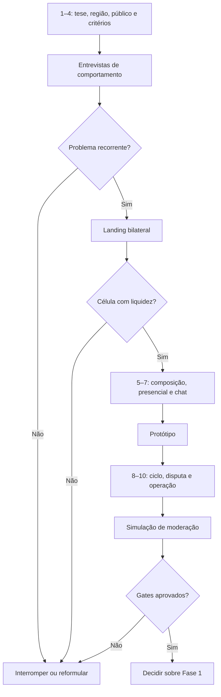

# EO-DISC-001 — Decisões para Bruno V1

**Projeto:** Escambo Online

**Data-base:** 29/07/2026

**Status:** perguntas priorizadas; nenhuma resposta presumida

## 1. Orientação

As decisões abaixo estão em ordem de dependência. Bruno não precisa fechar todo o produto agora:

- decisões 1 a 4 são necessárias antes da pesquisa;
- decisões 5 e 6 dependem dos primeiros resultados;
- decisões 7 a 10 devem ser fechadas antes do piloto e antes de modelagem técnica detalhada.

Quando houver alternativas, a recomendação indica a opção mais segura para testar; não equivale a decisão aprovada.

## 2. As dez decisões prioritárias

## 1 — Fronteira da tese: complemento financeiro

**Estado atual:** contraditório. A fonte-mestra e o escopo excluem complemento financeiro, mas o estado atual o lista como decisão pendente.

**Pergunta para Bruno:** o projeto deve testar “troca exclusivamente de bens, sem complemento financeiro” como a tese inicial, ou o complemento continuará como alternativa aberta para a descoberta?

**Recomendação:** manter o complemento fora do MVP testado, mas permitir que entrevistas revelem espontaneamente se sua ausência inviabiliza casos reais. Não apresentar PIX ou dinheiro como solução durante as perguntas.

**Impacto de não decidir:** entrevistas, protótipo, regras de negociação e avaliação de liquidez misturarão duas propostas diferentes; qualquer resultado ficará ambíguo.

**Momento:** antes de recrutamento.

## 2 — Região do piloto e unidade de liquidez

**Estado atual:** operação regional é proposta, mas nenhuma região ou raio foi escolhido.

**Pergunta para Bruno:** quais duas regiões candidatas têm público acessível para pesquisa e possibilidade real de um piloto controlado? A unidade será cidade, região administrativa, conjunto de bairros ou raio aproximado?

**Recomendação:** escolher duas candidatas para comparação e definir uma unidade de localização ampla, nunca endereço. Se a capacidade permitir apenas uma, dividi-la em três micro-regiões.

**Impacto de não decidir:** não é possível recrutar amostra, testar distância, medir bilateralidade ou interpretar liquidez.

**Momento:** antes de recrutamento.

## 3 — Público, categorias iniciais e itens proibidos

**Estado atual:** o público “adultos com itens usados” é amplo; categorias e política de itens proibidos estão pendentes.

**Pergunta para Bruno:** quais até três agrupamentos de categoria devem ser investigados primeiro e quais tipos ficam excluídos desde a pesquisa?

**Recomendação:** priorizar categorias transportáveis, inspecionáveis no encontro, de risco moderado e com frequência plausível de desapego. Excluir da descoberta itens ilícitos, regulados, de procedência incerta, perigosos, íntimos, de alto risco ou que exijam garantia especializada.

**Impacto de não decidir:** a amostra ficará dispersa, a liquidez será impossível de interpretar e a pesquisa poderá atrair situações inseguras.

**Momento:** antes de recrutamento e landing page.

## 4 — Critérios de decisão e tolerância ao resultado negativo

**Estado atual:** há indicadores propostos, mas não existem gates aprovados para manter, alterar ou rejeitar as hipóteses.

**Pergunta para Bruno:** você aprova os critérios propostos em `MATRIZ_HIPOTESES_V1.md`, inclusive a possibilidade de interromper ou estreitar o projeto se `H-01`, `H-02`, `H-05` ou `H-07` falharem?

**Recomendação:** pré-registrar os critérios antes da primeira entrevista. Ajustes metodológicos podem ocorrer, mas devem ser registrados antes de ver o resultado afetado.

**Impacto de não decidir:** resultados fracos poderão ser reinterpretados como sucesso; a descoberta vira justificativa da solução, não teste.

**Momento:** antes de qualquer coleta.

## 5 — Composição mínima: 1:1, 1:N ou N:N

**Estado atual:** os documentos usam formulações incompatíveis.

**Pergunta para Bruno:** qual variante deve ser usada como referência no protótipo e qual nível de complexidade exigirá evidência adicional?

**Recomendação:** usar 1:1 como baseline; testar 1:N como alternativa. Adiar N:N completo, salvo se entrevistas apresentarem casos recorrentes e o teste 1:N for compreendido sem erro.

**Impacto de não decidir:** o protótipo poderá validar uma variante enquanto domínio e histórias descrevem outra; aumenta-se prematuramente concorrência, reserva e risco de aceite errado.

**Momento:** depois das entrevistas de problema e antes do protótipo.

## 6 — Presencial, raio e compartilhamento progressivo

**Estado atual:** encontro presencial e privacidade progressiva são propostas, mas distância, dados e momento de revelação não estão definidos.

**Pergunta para Bruno:** qual é o limite inicial de deslocamento e quais informações podem ser compartilhadas antes da proposta, após proposta e após aceite?

**Recomendação:** testar região aproximada publicamente; manter telefone e local exato ocultos; comparar compartilhamento consentido após aceite com manutenção da conversa interna; proibir sugestão de residência como padrão.

**Impacto de não decidir:** o produto pode expor pessoas cedo demais ou tornar a conclusão impraticável; `H-05` não poderá ser avaliada.

**Momento:** faixa de distância investigada nas entrevistas; regra fechada antes do piloto.

## 7 — Momento do chat e controles de abuso

**Estado atual:** chat é parte do MVP proposto, mas seu momento de abertura é decisão pendente.

**Pergunta para Bruno:** haverá apenas mensagem inicial estruturada antes da resposta, chat livre após proposta, ou chat somente após aceite? O que o bloqueio faz em cada estado?

**Recomendação:** testar mensagem inicial com a proposta e chat livre somente quando a outra parte responder/interagir. Definir denúncia de mensagem, rate limit, bloqueio, preservação de evidência e acesso administrativo restrito.

**Impacto de não decidir:** afeta conversão, assédio, spam, exposição de contato, retenção de mensagens e capacidade de moderação.

**Momento:** antes do protótipo de confiança; regra final antes do piloto.

## 8 — Ciclo da proposta e concorrência

**Estado atual:** existem estados propostos, mas expiração, cancelamento, propostas concorrentes e efeitos do bloqueio estão pendentes.

**Pergunta para Bruno:** quando uma proposta expira, quem pode cancelar em cada estado e o que acontece às propostas concorrentes quando uma é aceita?

**Recomendação:** durante a descoberta, testar a expectativa do usuário sem fixar prazo arbitrário. Antes do piloto, definir: expiração; cancelamento antes/depois do aceite; invalidação de concorrentes; liberação de reserva; não comparecimento; e notificações essenciais.

**Impacto de não decidir:** o acordo pode ficar preso, duas pessoas podem acreditar que têm direito ao mesmo item e a jornada não terá final previsível.

**Momento:** após teste de fluxo e antes de modelo de estados aprovado.

## 9 — Conclusão, problema, disputa e reputação

**Estado atual:** confirmação bilateral é sugerida; conclusão unilateral e política de disputa estão pendentes; avaliação depende desse estado.

**Pergunta para Bruno:** o que acontece se somente uma parte confirmar, se houver não comparecimento ou se o item divergir? Quando a avaliação se torna permitida?

**Recomendação:** separar quatro ações: confirmar a própria participação; informar não comparecimento/problema; denunciar violação; solicitar análise. Não prometer arbitragem sobre valor ou autenticidade. Evitar reputação publicada enquanto o estado está contestado sem política definida.

**Impacto de não decidir:** reputação poderá registrar resultado falso, itens podem permanecer reservados e a moderação poderá assumir responsabilidade não planejada.

**Momento:** antes do piloto e antes de modelar estados finais.

## 10 — Elegibilidade, moderação e gate do piloto

**Estado atual:** idade mínima, verificação, responsável pela moderação, severidade, SLA, recurso e critérios de sucesso estão pendentes.

**Pergunta para Bruno:** quem poderá participar, quem operará a moderação, quantas horas estarão disponíveis, quais casos exigem resposta urgente e quais resultados farão o piloto continuar, reduzir ou parar?

**Recomendação:** manter a descoberta com adultos; definir verificação mínima proporcional e sem documento por padrão; nomear responsável e substituto; simular fila; limitar tamanho/categorias do piloto à capacidade comprovada; aprovar gates antes de admitir usuários reais.

**Impacto de não decidir:** o piloto não terá proteção operacional, critério de interrupção ou responsável por incidentes críticos.

**Momento:** desenho provisório antes da simulação; decisão final antes do piloto.

## 3. Quadro de resposta rápida

Bruno pode responder neste formato:

```markdown
## Respostas EO-DISC-001

1. Complemento financeiro:
   - decisão:
   - observação:

2. Regiões candidatas:
   - região A:
   - região B:
   - unidade de localização:

3. Público e categorias:
   - público:
   - categorias candidatas:
   - exclusões imediatas:

4. Critérios da matriz:
   - aprovado / alterar:
   - alterações:

5. Composição para protótipo:
   - baseline:
   - variante:

6. Presencial e contato:
   - orientação inicial:

7. Chat:
   - variante a testar:

8. Ciclo da proposta:
   - pendências ou orientação:

9. Conclusão e disputa:
   - pendências ou orientação:

10. Elegibilidade, moderação e piloto:
   - responsável futuro:
   - capacidade aproximada:
   - orientação:
```

## 4. Sequência de decisão recomendada



## 5. Decisões que não devem ser tomadas agora

- stack, versões de framework ou ORM;
- schema físico;
- provedor de nuvem ou storage;
- identidade visual e nome definitivo;
- algoritmo avançado de matching;
- monetização detalhada;
- expansão nacional;
- app nativo;
- automação sofisticada de moderação.

Esses temas dependem das decisões de produto e não reduzem os riscos críticos da Fase 0.
